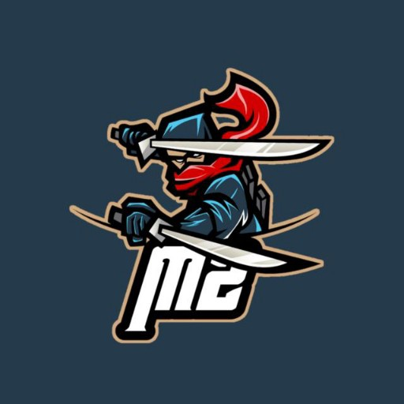
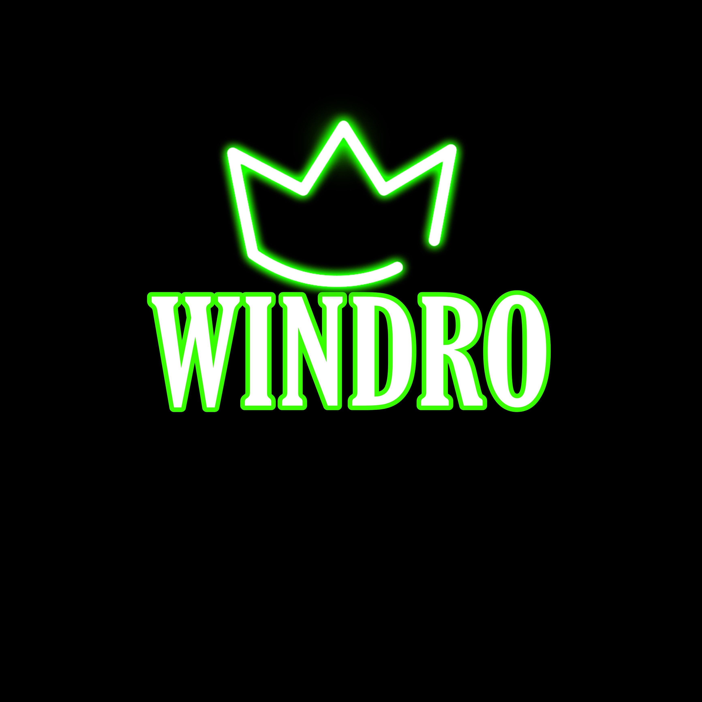

<div align="center">
  

  <p align="center">

<a href="#"></a>
 </p>
  <p align="center">
<a href="https://wa.me/918606413490"></a>
 </p>


<div align="center">
  

  <p align="center">


# 🛠️ JOIN FOR ANY DOUBT
<a href="https://chat.whatsapp.com/F4ruIq03W5b45cJcWAbvor"></a>
 </p>
  <div align="center">


<a href="#"></a>
 </p>
  <p align="center">
<div align="center">
<a href="#"></a>
 </p>
  <p align="center">
<div align="center">

  ### Simple Method

[](https://replit.com/@JihadSabeena123/JULIEV2-QR#index.js)

[](https://github.com/windro-ser/Botm2v1)
     </div>

     ## TERMUX SET UP

## The Hard Method

```js
GET QR
$ apt update
$ apt install nodejs --fix-missing
$ pkg install git
$ git clone https://github.com/windro-ser/Botm2v1
$ cd BOT M2
$ chmod +x *
$ npm install @adiwajshing/baileys
$ npm install chalk
$ node qr.js
```

```js
SETUP

$ git clone https://github.com/windro-ser/Botm2v1
$ cd BOT M2
$ chmod +x *
$ npm i
$ node qr.js
   // scan the qr using whatsapp web on your phone
$ node bot.js
```


### ⚠️ Warning!
```
Due to Userbot; !!Your WhatsApp account may be banned.!!
This is an open source project, you are responsible for everything you do.
Absolutely, Windro-SER do not accept responsibility.
By establishing the Userbot, you are deemed to have accepted these responsibilities.
```


Project created by windro to make it public

© Reserved

